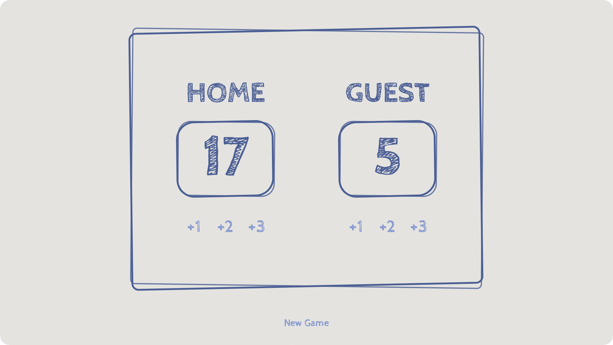

# 🏀 Game Score Board

✨ [GAME TIME](https://score-board-psi.vercel.app/)

A simple score board with Javascript. Wanted to make it a little playful so I experimented with before/after pseudo-elements to get the scribble borders.